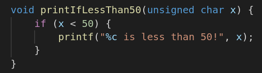
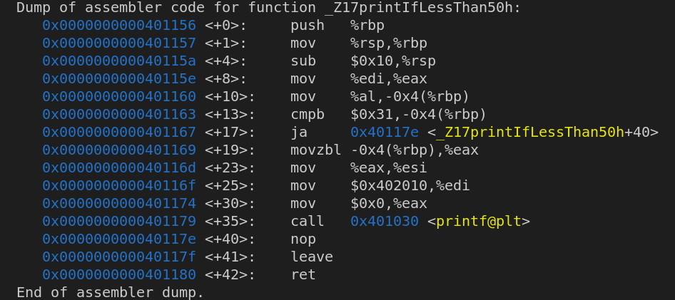
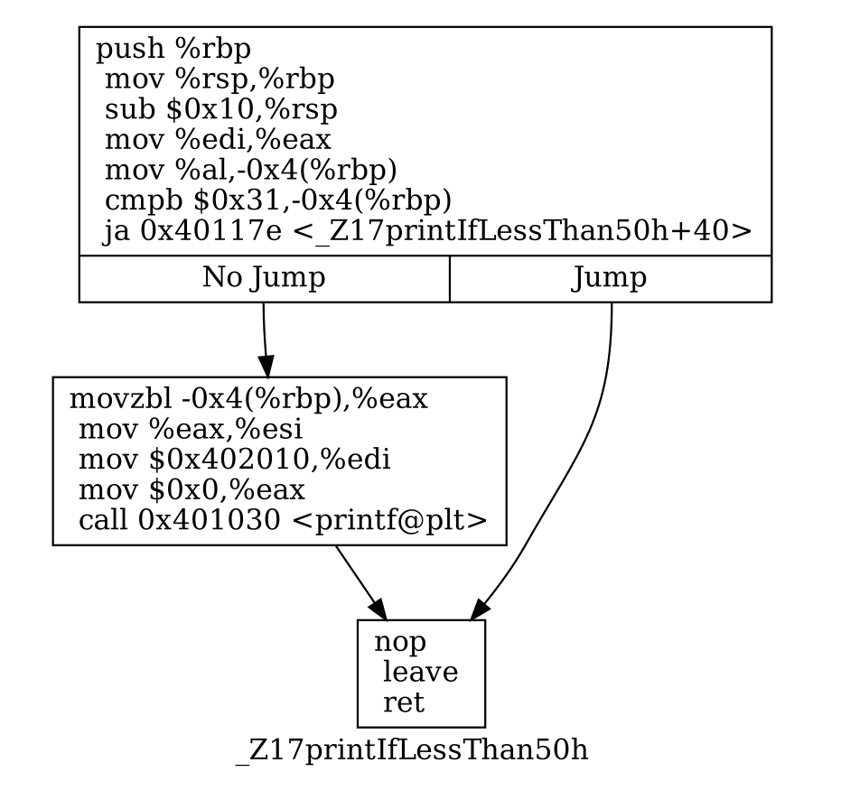

# An Investigation into programmer direct usage of Branchless Programming Concepts
### Produced by Ivan Hammel and Jacob Thomas for Advanced Computer Systems at Rensselaer Polytechnic Institute

## Introduction
Branch Prediction is one of the most crucial pieces of hardware within a CPU die for accelerating processor performance in a pipelined architecture. In a situation that otherwise would be uncertain, a successful branch prediction results in a speedup in performance over a scenario where the CPU would wait for the path of execution to be known. When a branch is unsuccessfully predicted by the CPU it results in what is called a pipeline stall.  A pipeline stall is when the CPU has loaded the wrong instructions because it predicted the wrong execution path.  This means that instructions must be re-loaded which incurs additional overhead in the program.

### What's a branch?
A branch instruction is how a computer typically deals with a statement of the form 'what if X'.  The condition X is a boolean value, and therefore can be used to deal with statements of fact such as 'is the variable y equal to 50' or 'is the variable p less than 20'.  In older CPU architectures, the predicate of a branch instruction (the conditional) must always be evaluated before the CPU can make a decision on where to jump.  A branch simply represents some runtime unknown that needs to be evaluated -- the result of this unknown determines which path you take at some 'fork in the road'.

For example, down below there is an example of some C code that contains an 'if' statement.  This statement will ultimately be compiled down into a conditional branch instruction.




Shown below is the assembler dump of this function which was created by using GDB.  The CMPB and JA instructions are comparison and jump instructions which come usually in tandem on x86 processors.  The CMP family of instructions performs a comparison between two principal registers and outputs the result of the comparison to the CPU ZFLAGS register where the result of the last comparison may be accessed by the following JE instruction.




Included for convenience below is a control flow diagram generated from the assembler dump of this function.  It clearly enumerates all potential execution paths dependent upon the conditional branch instructions.  If x happens to be less than 50, the CMPB and JA instructions will ensure that the CPU jumps to the segment containing the function call to printf.  If x is greater than or equal to 50, the conditional jump will enforce the other path.




### How do we avoid branches?
Branchless programming is the study of constructing creative solutions to pieces of code that otherwise would require branches to compute.  The main technique for doing so is to remove branches and replace them with their 'branchless' variants.  One such example would be the x86 instruction group SETcc.  This group of instructions looks at the ZFLAGS register and if the comparison meets the SETcc instruction's parameters, then a given register will be set with a 1, else a zero.


# Data Generation
```python3 generate_test_data.py```
Make sure you have the right sizes needed to run the tests. 10 x 2, 1000 x 1000, 5000 x 5000 (in unsigned int only).

# Compilation

```g++ datatable_test.cpp -fopenmp```
